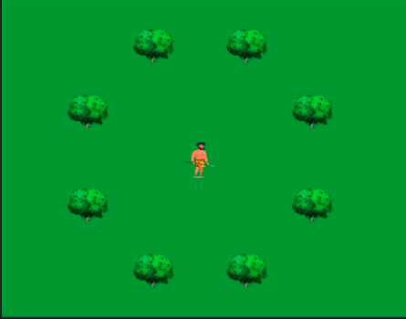
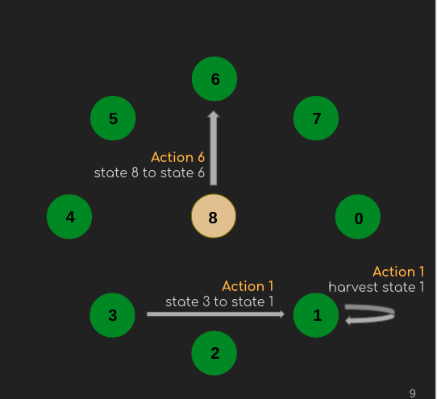
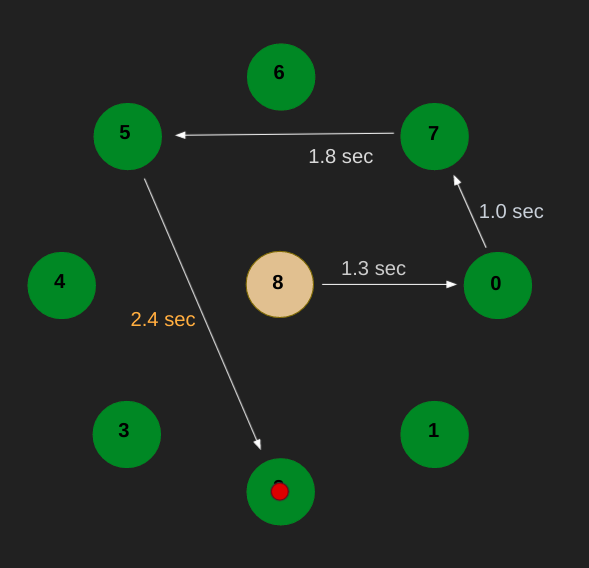
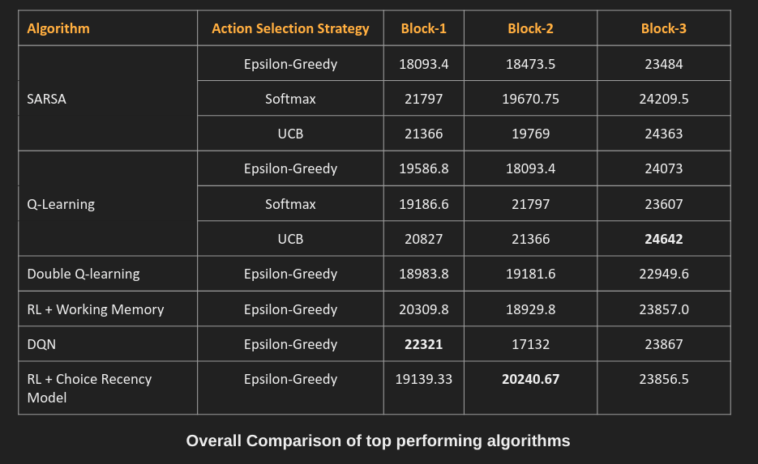

# CS698R-Project-Foraging-in-Replenishing-Patches-2

# Task Description

We tried to find an optimal agent to collect berries from replenishing bushes in the environment.
There is a time cost to travel between bushes and harvesting. The agent is allowed to go back to the bush they
have harvested in the past. Each bush may or may not have berries, and the number of berries collected from a
bush decreases with each harvest. This environment is hence very close to the real-life problem of foraging in which
there are a limited number of bushes that the human keeps revisiting and bushes replenish when not being eaten,
and there is a decay of berries when the bush is being eaten. A real-life example of such an environment is the
movement of migratory birds and the movement of cattle by nomadic people. To describe in short, the aim of the task is helping the gatherer collect maximum amount of berries in given time under some basic constraints.



The 4 basic conditions :
* Only 4 bushes have berries
* On harvesting a rewarding bush:
  * Berries on that bush decrease
  * Berries on other rewarding bush replenish 
* Each action takes some time to complete
* Each block is played for 300 seconds

### STATES, ACTIONS and REWARDS

* There are 9 total states

* State 8 is our initial state and once agent leaves it can’t come back

* The actions are moving to any state labelled 0-7 and harvesting at  the present state




* Only 4 bushes have reward which can grow to a max value of 200
Whenever we mine a bush currently having a reward r.
  * collected_reward += 0.9 * r
  * r = floor(0.9*r)
  * When we mine a bush having reward all the other bushes with reward are replenished according to their replenishment rate

### Time Cost for Actions

* Every Action takes a predetermined amount of time, shown in figure below.
* Harvesting takes 1 second



# CODE Description

## Repository Structure

The directory structure is as follows :

```sh
  - src/
    - gym-env/
    - policies/
    - blocks.py
    - *.ipynb
  - images/
  - report.pdf
  - presentation.pdf
  - README.md
```

The `src` folder contains all the necessary code.
-   `gym-env` folder contains files which basically implements the environment. 
- The different blocks are implemened through `blocks.py`. 
- The folder also contains various `ipynb` notebooks, which are used to train/render policies on the environment. The notebooks are well documented.

The images folder contain images present in README.md.
The report and presentation are same as submitted during the endsem project submission.

## Dependencies

In order to run the notebooks, following dependencies are required :
 
* python : 3.8
* torch
* gym
* pygame

## How to register and make environment?


* Firstly, register the environment using below 
````sh
  cd src/
  pip install -e gym-env
````
* To build the blocks

```python 
from blocks import EnvClass
envs = EnvClass()
```
* To access the env corresponding to a particular block, use getBlock()

```python
env_b1 = envs.getBlock(1) # block-1
env_b2 = envs.getBlock(2) # block-2
env_b3 = envs.getBlock(3) # block-3
```

## How to train an agent?


To train a particular agent, run the corresponding ipynb. Every ipynb registers the environment itself. Every notebook has its first cell as a header which describe the basic overview of that notebook.

## How to render a policy/env?

* `demo_agent.ipynb` has been used to render a learned policy. The demos links are provided at last.
* `rendering.ipynb` can be used to play the game via human agent.

# Methodology And Results

* We first implemented a baseline agent using a Q-function of state-action pairs. Incorporated the effect of  decreasing and replenishing rewards using previous reward, Q(s,r,a).
* Trained multiple Tabular and Deep RL agents, and explored the affects of different action-selection strategies on training behaviour
* Incorporated a working memory module with the RL agents to mimic the learning curves for the task seen in human players.
* Implemented a choice recency module with the SARSA algorithm, to incorporate the effect of previous choices.

The overall results of different algorithms are described in below figure :




# DEMO

The demo links for policies learned via Q-learning (softmax action select strategy) are given below :

* Block 1 : [Link](https://youtu.be/rFWviu38KWk)
* Block 2 : [Link](https://youtu.be/NbNzVyUTxm0)
* Block 3 : [Link](https://youtu.be/Es_YySZKv34)
